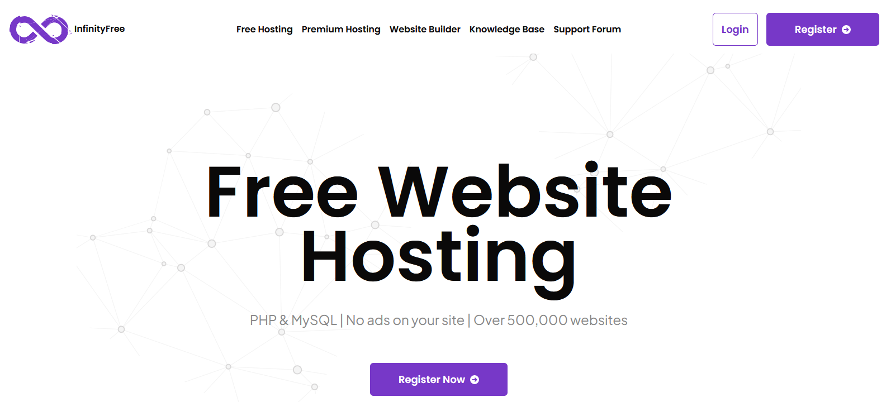
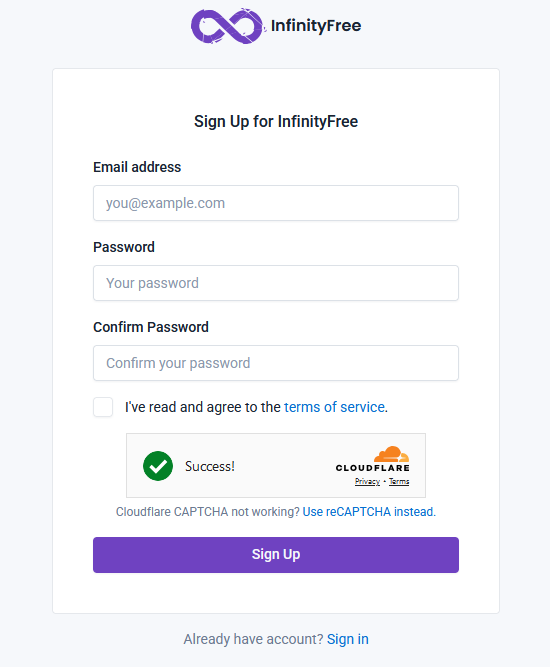
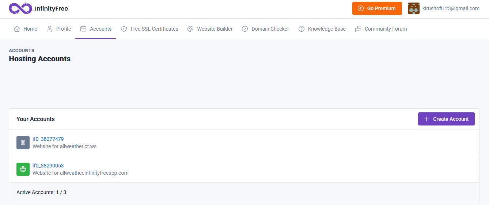
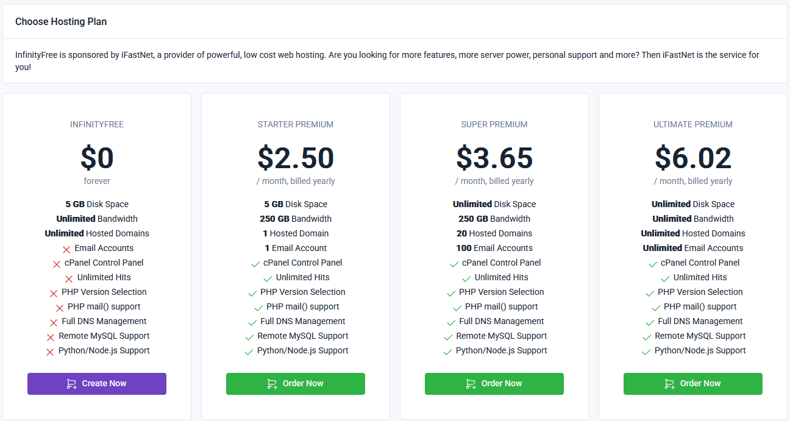
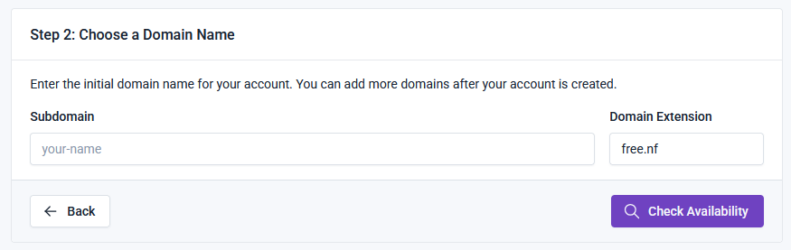
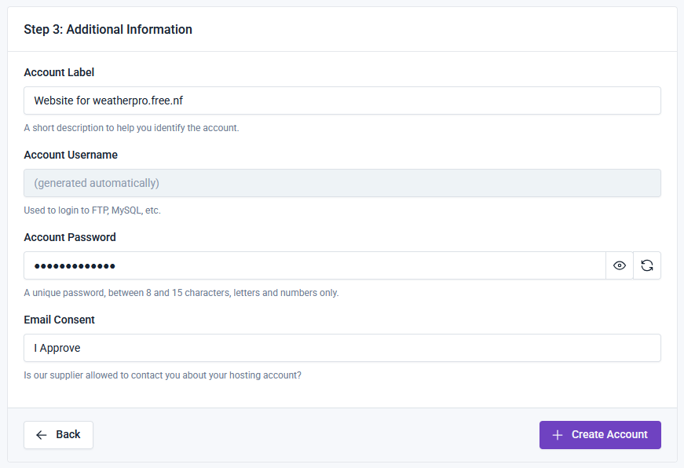
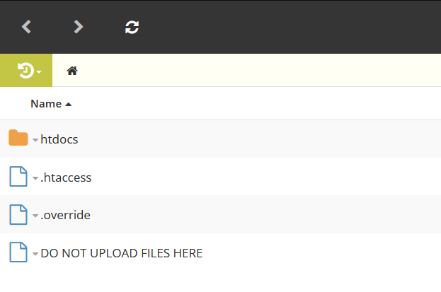
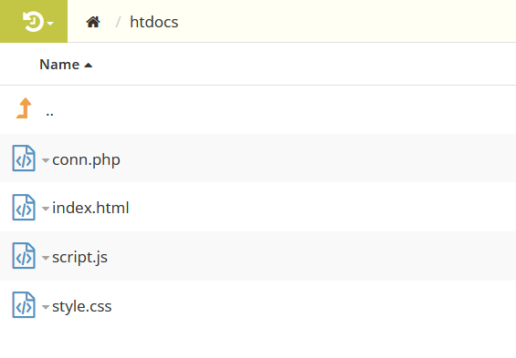
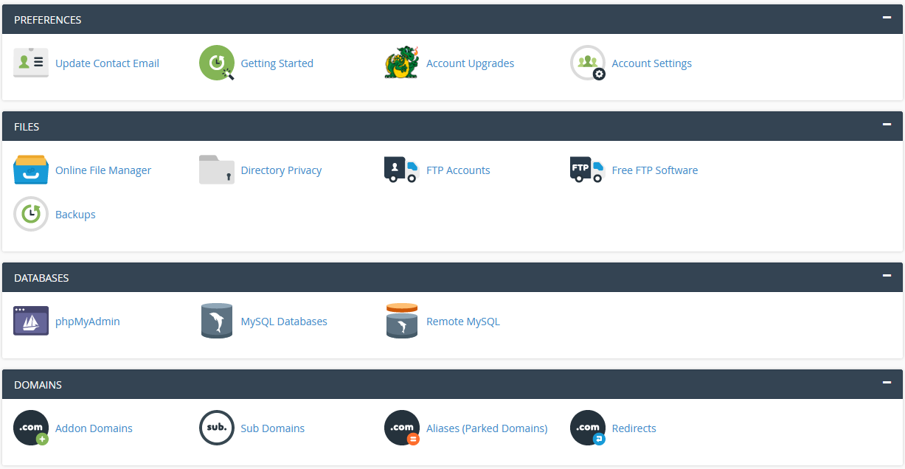
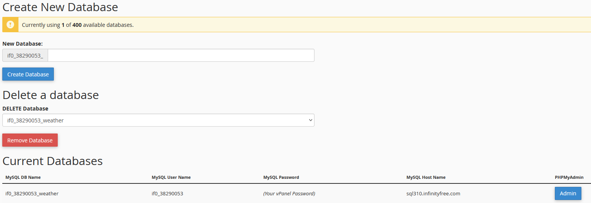

# Web-Hosting-Guide

## InfinityFree Guide

### Account Creation

1. Go to [InfinityFree](https://www.infinityfree.com/).
2. Click on the **Register** button.
   
3. Fill in your email address, password, and agree to the terms of service.
   
4. Click on the **Sign Up** button.
5. Verify your email address by clicking on the link sent to your email.

### Domain Setup

1. Log in to your InfinityFree account.
2. Click on the **Create Account** button.
   
3. Choose the option which costs $0.
   
4. Enter the Subdomain name, choose domain extension and Check Availability.
   
5. Choose **I approve** below the Email Consent and click Create Account.
   
6. Once the nameservers are updated, click on the **Create Account** button.
7. Wait for the account to be created and your domain to be set up.

### Uploading Files

1. Click on the File Manager.
   
2. Open **htdocs** folder, delete any files present and upload your 4 files (HTML, CSS, JS and PHP).
   
   

### Managing Databases

1. In the **Control Panel**, go to the **MySQL Databases** section.
   
   
2. Create a new database by entering a name and clicking on the **Create Database** button.
   
3. Note down the database name, username, password and hostname.
4. Use these credentials to connect your website to the database.
