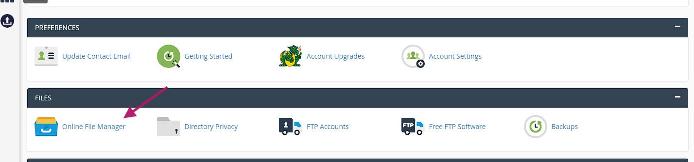

## Setting Up the Website using CPanel

### Uploading Files

1. Open Cpanel as shown below

2. Open File Manager and navigate inside the htdocs folder

3. Uploads your codes here

### Creating a database for our domain

1. Navigate to the database tab in the Cpanel and click on the **MySQL Databases**

2. Create a database by any name (E.g. WeatherData) and click on create database

3. Now, the database is finally created.

4. Note down the MySQL DB name somewhere safe (E.g. Notepad).

### Saving required credentials

1. Navigate back to the Cpanel (mentioned above)

2. On the right side of Cpanel you be able to see account details section

3. Copy all the requird credentials and save somewhere like Notepad. - MySQL Hostname - MySQL Username
   

4. You will need password too, for that navigate back to this website https://dash.infinityfree.com/accounts/

Copy the password too.

### Chaning Credentials inside connection.php

1. Put the saved MySQL hostname in servername (or hostname) variable
   

2. Put the MySQL username in the username variable
   

3. Likewise put the saved password in the password variable.

4. Comment out the createDB query (if exists)

   
5. Put your previously saved database name in the select_db query

   

6. Save the changes

### Chaning path in JavaScript

Previously, we had hosted the weather app locally on your device and on JavaScript we had used the **localhost/connection.php** path to fetch data but since we are hosting the website on a server so we have to change the path now.

1. Open your JavaScript file.

2. Navigate to this line of code

   

3. Remove the localhost part and only leave **/connection.php?q={city}** part.

   

4. Save the file